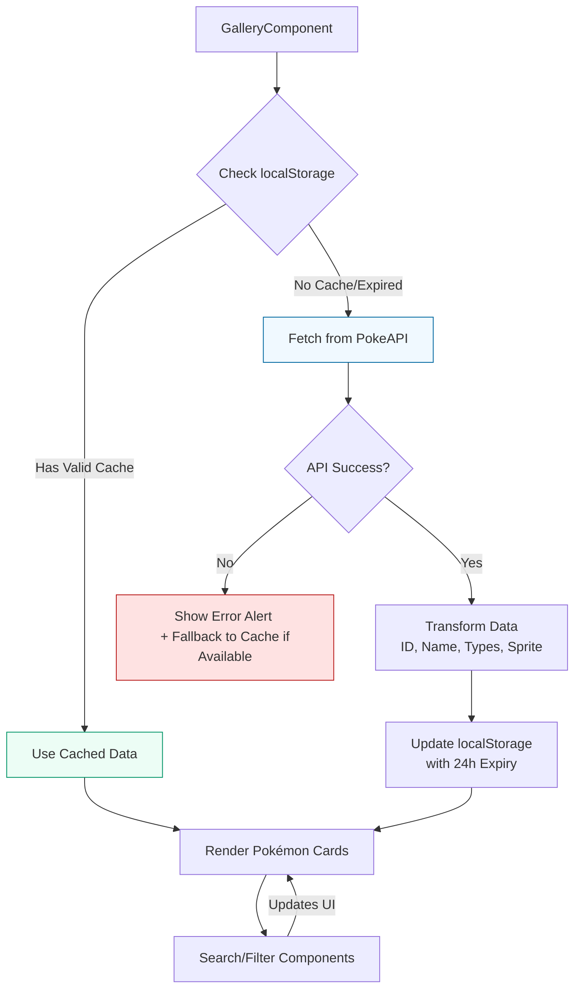

<div align="center">
  
</div>

# PokiFind 🐸

A web app which fetches data from `PokéAPI(v2)` and renders them in card format (displaying **ID**, **Sprite**(_Image_),**Name**, **Type**).

## 📸 Project Screenshot

Preview of how website looks on different screen sizes

### 1) Light Mode

<div style="
  display: grid;
  grid-template-columns: repeat(2, 1fr);
  gap: 10px;
  justify-items: center;
  align-items: center;
">
  <div style="height: 300px; display: flex; justify-content: center;">
    
  </div>
  <div style="height: 300px; display: flex; justify-content: center;">
    
  </div>
  <div style="height: 300px; display: flex; justify-content: center;">
    
  </div>
  <div style="height: 300px; display: flex; justify-content: center;">
    
  </div>
</div>
<p align="center">
  <em>PokiFind in different views (Desktop and Mobile)</em>
</p>

### 1) Dark Mode

<div style="
  display: grid;
  grid-template-columns: repeat(2, 1fr);
  gap: 10px;
  justify-items: center;
  align-items: center;
">
  <div style="height: 300px; display: flex; justify-content: center;">
    
  </div>
  <div style="height: 300px; display: flex; justify-content: center;">
    
  </div>
  <div style="height: 300px; display: flex; justify-content: center;">
    
  </div>
  <div style="height: 300px; display: flex; justify-content: center;">
    
  </div>
</div>
<p align="center">
  <em>PokiFind in different views (Desktop and Mobile)</em>
</p>

## ⚙️ Technologies/Libraries

### Core Libraries:

- React 19 (Latest version of React (currently in beta) for building UI components.)
- Vite (Blazing-fast build tool for modern React apps.)
- Tailwind CSS (Utility-first CSS framework for rapid UI development.)
- Flowbite React (UI component library (dropdowns, modals, etc.) built for React + Tailwind.)
- Axios (Promise-based HTTP client for API calls (used for PokeAPI).)

### Key Tools:

- ESLint (Linting for code quality (with React-specific plugins like react-hooks).)
- React Icons (Popular icon library (e.g., Font Awesome, Material Icons).)
- NanoID (Tiny library for generating unique IDs (likely used for keys/state).)

## ⚒️ Working

Working of PokeFind 🐸 is as below:



## 🌐 API Used

This project utilizes the official [PokéAPI v2](https://pokeapi.co/) with the following endpoint:

```bash
GET https://pokeapi.co/api/v2/pokemon?limit=150
```

**Response:**

```json
{
    "count": 1302,
    "next": "https://pokeapi.co/api/v2/pokemon?offset=150&limit=150",
    "previous": null,
    "results": [
        {
            "name": "bulbasaur",
            "url": "https://pokeapi.co/api/v2/pokemon/1/"
        },
        {
            "name": "ivysaur",
            "url": "https://pokeapi.co/api/v2/pokemon/2/"
        }
        ........
    ]
}
```

- Fetches first 150 Pokémon in a single request
- Secondary requests for each Pokémon's details (sprites, types) using url present in results array.
- Data transformed to only keep relevant fields:

```json
[
  {
  "id": 1,
  "name": "bulbasaur",
  "types": ["grass", "poison"],
  "sprite": "https://raw.githubusercontent.com/PokeAPI/sprites/master/sprites/pokemon/1.png"
  }
  .......
]
```

## 📂 Folder Structure

The folder structure of this app is explained below:

| Name               | Description                                                                                                                             |
| ------------------ | --------------------------------------------------------------------------------------------------------------------------------------- |
| **node_modules**   | Contains all npm dependencies                                                                                                           |
| **public**         | The public directory contains static assets that are served directly (unprocessed) by Vite.                                             |
| **src**            | Contains source code that will be compiled to the dist dir                                                                              |
| **src/components** | Contains all the components of React App                                                                                                |
| **src/context**    | Contains context to consumed by consumers elements (SearchContext.jsx is used to provide a bridge between gallery and navbar component) |
| **src/hooks**    | Contains custom hooks created by developer to concise the logic at one place. |
| **src/utils**      | Utils contains all the helper functions for react app                                                                                   |
| **src/assets**     | Assets for React app (Like images)                                                                                                      |
| **src**/index.jsx  | Entry of React App                                                                                                                      |
| **src**/App.jsx    | App file of React file which imports all the other components                                                                           |
| package.json       | Contains npm dependencies as well as [build scripts](#what-if-a-library-isnt-on-definitelytyped)                                        |
| eslint.config.json | Configures ESLint rules for code quality and consistency.                                                                               |
| index.html         | The single HTML entry point for your Vite+React app.                                                                                    |
| vite.config.js     | Configures the Vite build tool.                                                                                                         |

## 🧑‍💻 Installation

1. clone the repository using Git CLI or Download source zip

```bash
git clone https://github.com/Durubhuru14/poki-find.git
cd poki-find
```

2. Install all the dependencies

```bash
npm install
```

3. Run the development server

```bash
npm run dev
```

## 🛠️ Available npm Scripts

| Command               | Action                                                   | When to Use                       |
| --------------------- | -------------------------------------------------------- | --------------------------------- |
| `npm run dev`         | Starts Vite dev server with HMR (Hot Module Replacement) | Local development                 |
| `npm run build`       | Creates optimized production build in `dist/` folder     | Before deployment                 |
| `npm run lint`        | Runs ESLint to check for code errors/warnings            | Before commits or PRs             |
| `npm run preview`     | Serves the production build locally for testing          | After `build` to verify output    |
| `npm run postinstall` | Auto-runs `flowbite-react patch` after install           | (Automatic) Fixes Flowbite compat |

### Usage Examples

```bash
# Start development server (default: http://localhost:5173)
npm run dev

# Lint all files (with auto-fix where possible)
npm run lint -- --fix

# Full production workflow
npm run build && npm run preview
```

## 🐣 Author

**Durvesh More** (Online alias: **Durubhuru**)
🎓 Computer Science Undergrad (2027) | University of Mumbai

> **PokeFind** was developed as an original assignment for an internship application.
> **I hereby declare** that this is my own work and no plagiarism was involved in its creation.

### 🌐 Connect With Me

📧 **Email**: [durveshmore.drm@gmail.com](mailto:durveshmore.drm@gmail.com)
🔗 **GitHub**: [Durubhuru14](https://github.com/Durubhuru14)
💼 **LinkedIn**: [Durvesh More](https://www.linkedin.com/in/durvesh-more-1016ab282)
📸 **Instagram**: [@durubhuru](https://www.instagram.com/durubhuru/)

---

Made with ❤️ by **Durubhuru**
